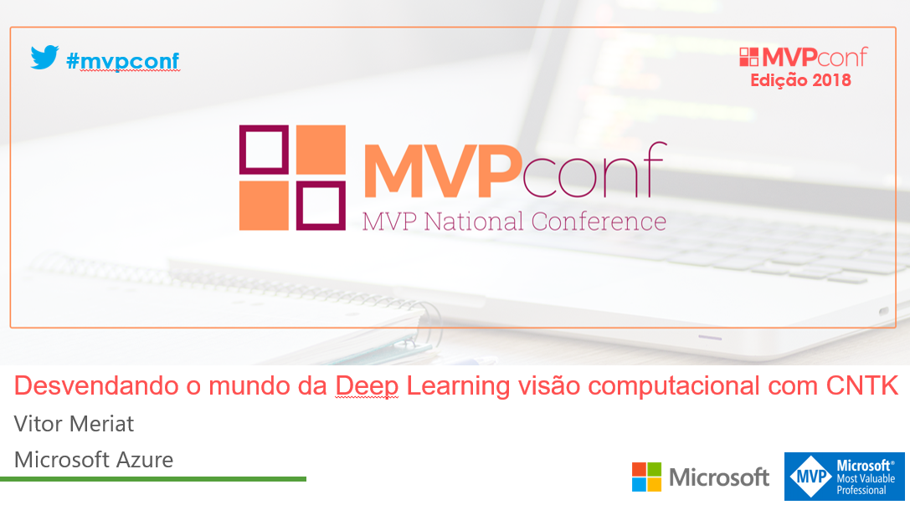

# Desvendando o mundo da Deep Learning com visão computacional e CNTK

* **Data:** 07-04-2018
* **Evento:** [MVPConf](https://www.mvpconf.com.br/)

  

## Descrição

Nesta palestra estive falando sobre o que é **Deep Learning**. Esta foi uma visão baseada na visão computacional, onde vimos algumas das dificuldades envolvidas neste campo. 

Tanto a questão dos problemas relacionados a disciplina em si (visão computacional), quanto os problemas relacionados a parte da computação.

Um outro ponto importante foram os testes mostrando as vantagens de se utilizar processamento na **GPU** em detrimento ao processamento na **CPU** quando falamos de **Deep Learning** e **cálculos matriciais**.

Outro **benchmark** foi testar efetivamente a velocidade de processamento dos frameworks **CNTK (Microsoft Cognitive Toolkit)** & **TensorFlow** realizando operações simples de **cálculos matriciais** (não comparando todos os aspectos envolvidos).

O grande final foi mostrar **Redes geradoras adversárias ou GANs (Generative Adversarial Networks)**, para a criação de faces com base no famoso dataset **CelebA (CelebFaces Attributes Dataset)**, com mais de 200.000 imagens de celebridades.

---

#### De coração, muito obrigado a todos os participantes ;)
