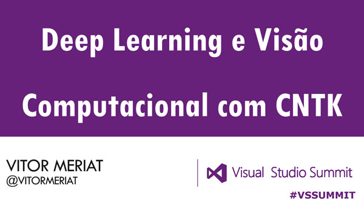
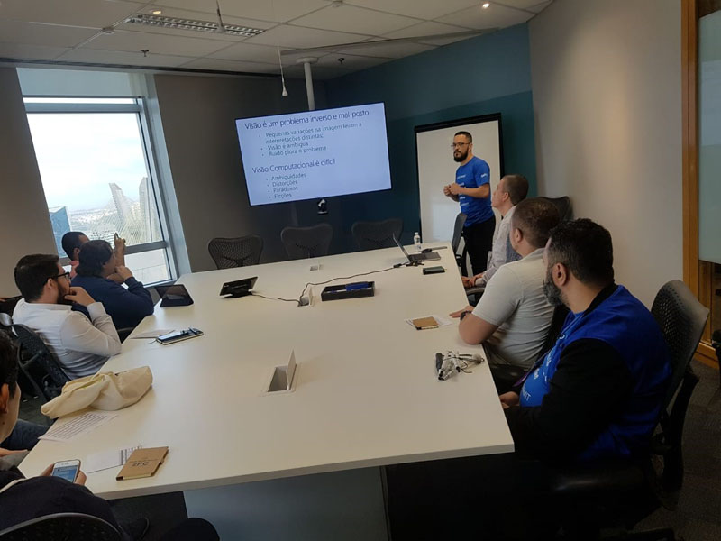

# DeepLearning e visão computacional com CNTK

* **Data:** 02-06-2018
* **Evento:** [Visual Studio Summit 2018](http://devprime.one/)

  

## Descrição

Este evento foi dividido em dois dias, ondo no primeiro tive a oportunidade de palestrar no auditório 01 da Microsoft, com a sala cheia. O segundo dia foi uma mesa redonda com uma galera mais especializada e focada no conteúdo em si.

Estive falando sobre os problemas inversos e mal-postos envolvendo o campo da visão computacional.

Falamos como o poder da Nuvem, e neste caso do **Microsoft Azure**, pode nos auxiliar na hora de trabalharmos com os algorítimos de **Deep Learning**.

Por final falamos do uso da **AI** na criação de **DeepFake**, e usamos como exemplo uma **Rede geradora adversária (Generative Adversarial Networks)**, para ilutrar o poder da Deep Learning.

---

#### Author

[Vitor Meriat](http://www.vitormeriat.com.br/) is a computer scientist who is passionate about creating software that will positively change the world we live in.

:alien: <a class="fa fa-twitter" aria-hidden="true" href="https://twitter.com/vitormeriat" target="_blank"> twitter</a> | <a class="fa fa-facebook" aria-hidden="true" href="https://www.facebook.com/vitormeriat/" target="_blank"> facebook</a> | <a class="fa fa-instagram" aria-hidden="true" href="https://www.instagram.com/vitormeriat/" target="_blank"> instagram</a> | <a class="fa fa-linkedin" aria-hidden="true" href="https://www.linkedin.com/in/vitormeriat" target="_blank"> linkedin</a> | <a class="fa fa-youtube" aria-hidden="true" href="https://www.youtube.com/user/vitormeriat/" target="_blank"> youtube</a>

 

#### De coração, muito obrigado a todos os participantes ;)
