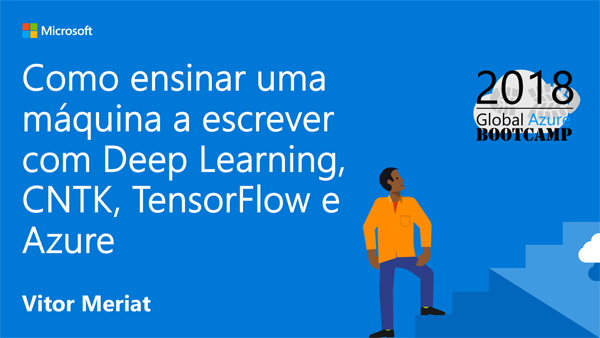

# Como ensinar uma máquina a escrever com Deep Learning, CNTK, TensorFlow e Azure

* **Data:** 21-04-2018
* **Evento:** [Azure Bootcamp Campinas 2018](https://azurebootcamp.venturus.org.br/)

  

## Descrição

Nesta palestra vimos qual a importância da **Cloud Computing** e sua correlação com as evoluções nas pesquisas e desenvolvimento do que temos de melhor em termos de **Inteligência Artificial**.

Utilizei o famoso dataset **MNIST** para ilustrar algumas das dificuldades computacionais envolvidas nos problemas de visão computacional, e assim introduzir algumas técnicas novas que nos levam ao mundo da **Deep Learning**. 

Um outro ponto importante foram os testes mostrando as vantagens de se utilizar processamento na **GPU** em detrimento ao processamento na **CPU** quando falamos de **Deep Learning** e **cálculos matriciais**.

Utilizei o **Microsoft Azure** como player de cloud, mostrando todas as capacidades existentes no Azure para processamento de GPU ou com foco em DeepLearning.

Por fim falamos de **Redes geradoras adversárias ou GANs (Generative Adversarial Networks)**, para a criação de dígitos e faces com base no famoso dataset **CelebA (CelebFaces Attributes Dataset)**, com mais de 200.000 imagens de celebridades.

---

#### Author

[Vitor Meriat](http://www.vitormeriat.com.br/) is a computer scientist who is passionate about creating software that will positively change the world we live in.

 
:alien: <a class="fa fa-twitter" aria-hidden="true" href="https://twitter.com/vitormeriat" target="_blank"> twitter</a> | <a class="fa fa-facebook" aria-hidden="true" href="https://www.facebook.com/vitormeriat/" target="_blank"> facebook</a> | <a class="fa fa-instagram" aria-hidden="true" href="https://www.instagram.com/vitormeriat/" target="_blank"> instagram</a> | <a class="fa fa-linkedin" aria-hidden="true" href="https://www.linkedin.com/in/vitormeriat" target="_blank"> linkedin</a> | <a class="fa fa-youtube" aria-hidden="true" href="https://www.youtube.com/user/vitormeriat/" target="_blank"> youtube</a>

#### De coração, muito obrigado a todos os participantes ;)
