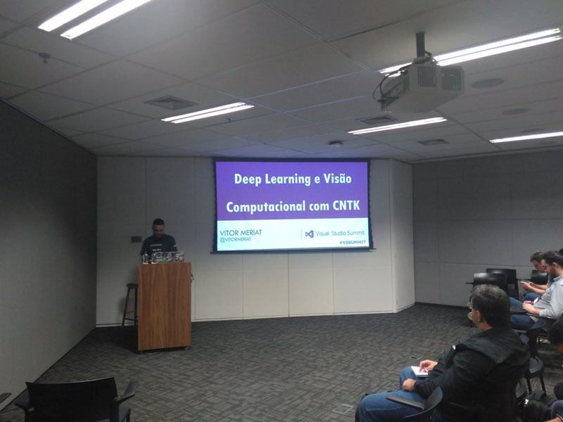

# DeepLearning e visão computacional com CNTK

* **Data:** 02-06-2018
* **Evento:** [Visual Studio Summit 2018](http://devprime.one/)

  

## Material

:floppy_disk: [LINK para a Apresentação no SlideShare](https://www.slideshare.net/VitorMeriat/deep-learning-e-viso-computacional-com-cntk)

## Descrição

Este evento foi dividido em dois dias, ondo no primeiro tive a oportunidade de palestrar no auditório 01 da Microsoft, com a sala cheia. O segundo dia foi uma mesa redonda com uma galera mais especializada e focada no conteúdo em si.

Estive falando sobre os problemas inversos e mal-postos envolvendo o campo da visão computacional.

Falamos como o poder da Nuvem, e neste caso do **Microsoft Azure**, pode nos auxiliar na hora de trabalharmos com os algorítimos de **Deep Learning**.

Por final falamos do uso da **AI** na criação de **DeepFake**, e usamos como exemplo uma **Rede geradora adversária (Generative Adversarial Networks)**, para ilutrar o poder da Deep Learning.

---

 

