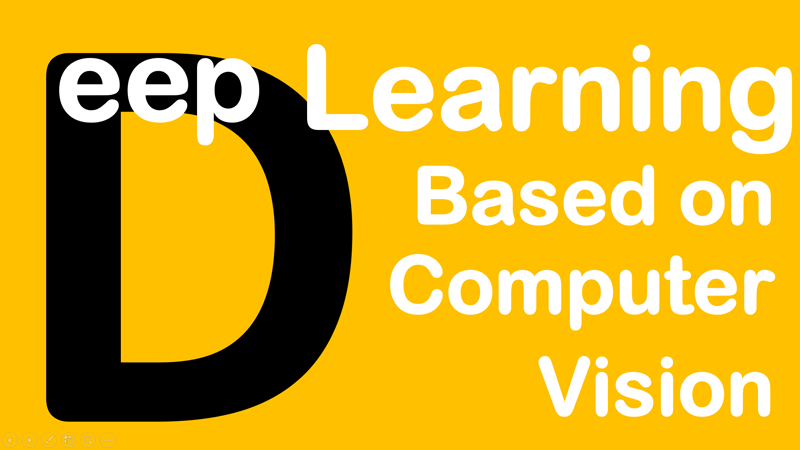

# Deep Learning based on Computer Vision

* **Data:** 04-09-2018
* **Evento:** [Meetup AI with Python at Microsoft](https://www.meetup.com/pt-BR/DevelopersBR/events/254075042/)

  

<iframe src="//www.slideshare.net/slideshow/embed_code/key/d8FeBJw541aNmG" width="595" height="485" frameborder="0" marginwidth="0" marginheight="0" scrolling="no" style="border:none; max-width: 100%;" allowfullscreen> </iframe>

## Descrição

TBA.

## Referências

1. [CNTK Tutoriais](https://github.com/Microsoft/CNTK/blob/master/Tutorials/CNTK_101_LogisticRegression.ipynb)

---

 

#### Valeu galera ;)
