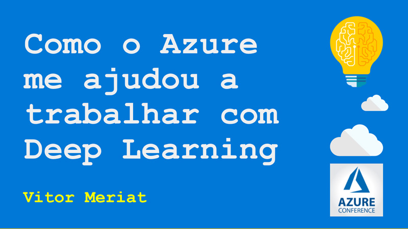
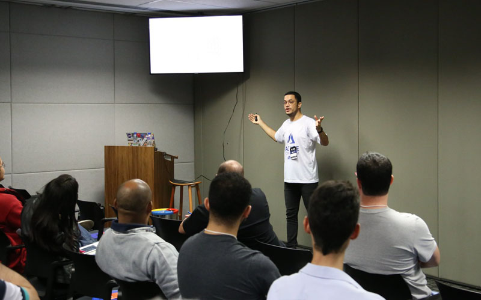

# Como o Azure me ajudou a trabalhar com Deep Learning

* **Data:** 20-10-2018
* **Evento:** Azure Conference at Microsoft

  

## Material

:floppy_disk: [LINK para a Apresentação no SlideShare](https://www.slideshare.net/VitorMeriat/como-o-azure-me-ajudou-a-trabalhar-com-deep-learning)

## Descrição

Palestra focada na introdução ao ambiente **HPC** da Microsoft para suporte ao trabalho com **Deep Learning**, em conjunto com a introdução ao **CNTK**.

---

 
