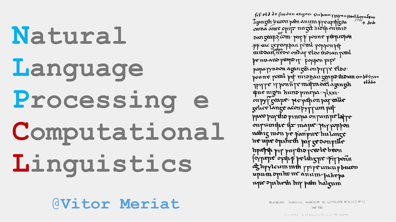

# Natural Language Processing e Computational Linguistics

* **Data:** 10-12-2018
* **Evento:** ESX TechLives
* [sympla.com.br/esx-tech-lives-inteligencia-artificial](https://www.sympla.com.br/esx-tech-lives---inteligencia-artificial__414703#info)

  

 

## Material

:floppy_disk: [LINK para a Apresentação no SlideShare](https://www.slideshare.net/VitorMeriat/natural-language-processing-e-computational-linguistics)

## Descrição

Introdução ao **Processamento de Linguagem Natural** e **Linguística Computacional** utilizando **SpaCy** e demonstrando a participação do **CNTK** na modelagem de **Language Undertanding**.