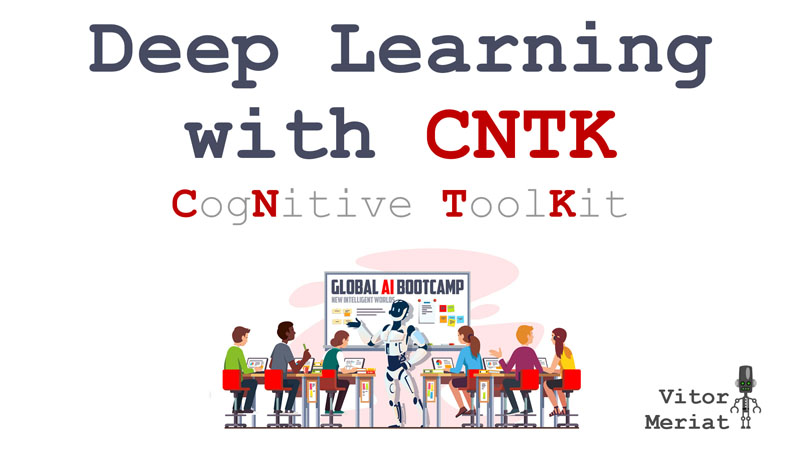
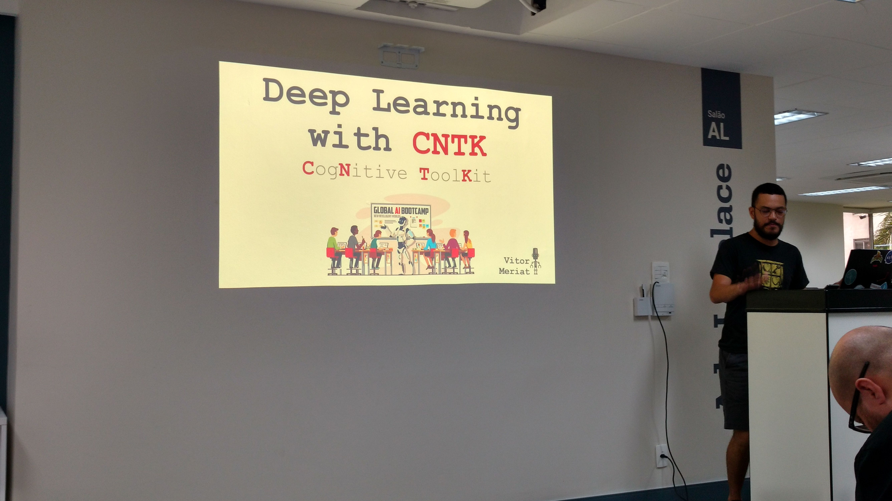

# Deep Learning with CNTK

* **Data:** 15-12-2018
* **Evento:** Global AI Bootcamp 2018
* [globalaibootcamp.com](https://www.globalaibootcamp.com)
* [meetup.com/pt-BR/DevelopersBR](https://www.meetup.com/pt-BR/DevelopersBR/events/255057782/)

  

## Material

:floppy_disk: [LINK para a Apresentação no SlideShare](https://www.slideshare.net/VitorMeriat/deep-learning-with-cntk-126058130)

## Descrição

Palestra de introdução ao mundo da **deeplearning** utilizando o framework **CNTK** para o processamento em **GPU** na plataforma **.NET** com **C#**.

  

