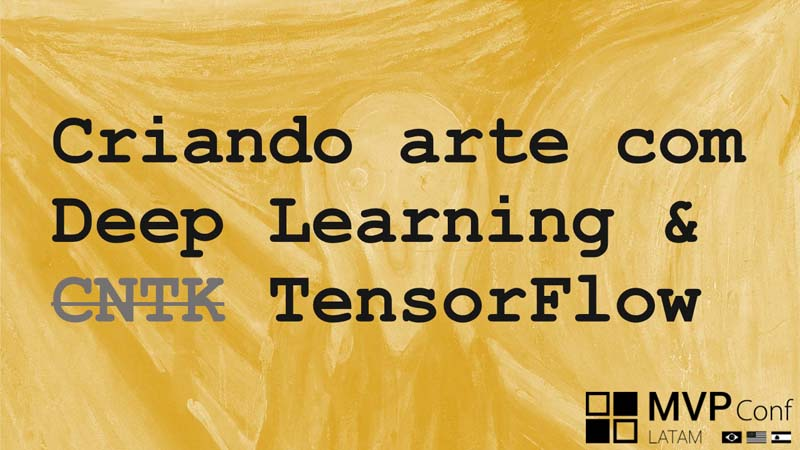
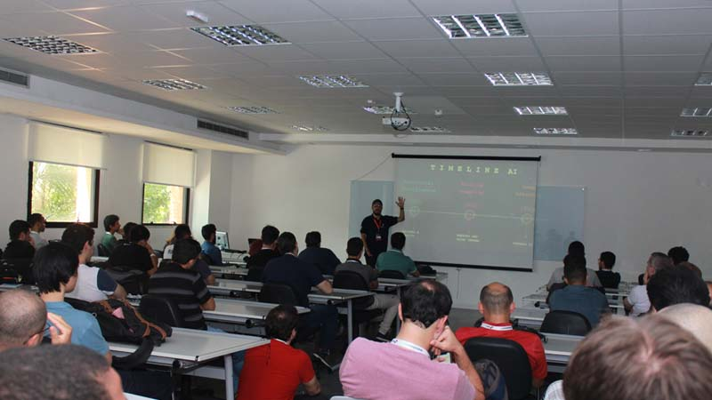
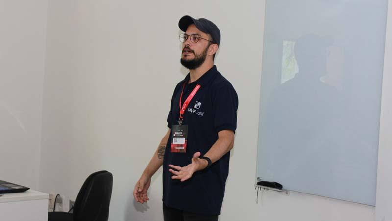

# Criando arte com Deep Learning - CNTK - TensorFlow

* **Data:** 13-04-2019
* **Evento:** MVP Conf Latam 2019
* [mvpconf.com.br](https://mvpconf.com.br/)

  

## Material

:floppy_disk: [LINK para a Apresentação no SlideShare](https://www.slideshare.net/VitorMeriat/criando-arte-com-deep-learning-cntk-tensorflow)

## Descrição

Palestra para ilustração da criação de conteúdo, neste caso arte, utilizando **Deep Learning**, com redes como **GANs**.

  
  
  

