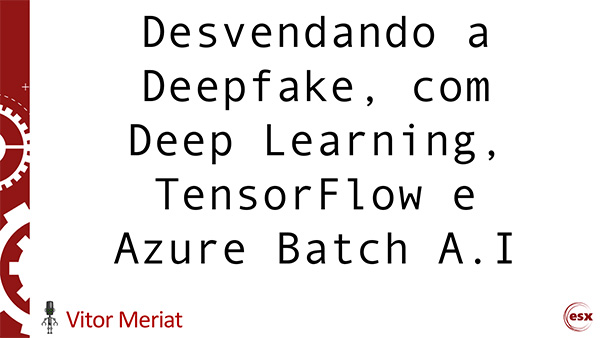

# Desvendando a Deepfake, com Deep Learning, TensorFlow e Azure Batch A.I

* **Data:** 24-07-2018
* **Evento:** [ESX Tech Live](https://esx-tech-live.azurewebsites.net/)

  

## Descrição

TBA.

## Referências

1. [Synthesizing Obama: Learning Lip Sync from Audio](http://grail.cs.washington.edu/projects/AudioToObama/siggraph17_obama.pdf)
2. [Robust Real-time Object Detection, Paul Viola & Michael Jones](https://www.researchgate.net/publication/215721846_Robust_Real-Time_Object_Detection)
3. [In the days before Photoshop (1984)](https://www.youtube.com/watch?v=SvVJHjzwhzU)
4. [TensorFlow](https://www.tensorflow.org/)
5. [Azure Batch AI](https://azure.microsoft.com/en-us/services/batch-ai/)

---

#### Author

[Vitor Meriat](http://www.vitormeriat.com.br/) is a computer scientist who is passionate about creating software that will positively change the world we live in.

:alien: <a class="fa fa-twitter" aria-hidden="true" href="https://twitter.com/vitormeriat" target="_blank"> twitter</a> | <a class="fa fa-facebook" aria-hidden="true" href="https://www.facebook.com/vitormeriat/" target="_blank"> facebook</a> | <a class="fa fa-instagram" aria-hidden="true" href="https://www.instagram.com/vitormeriat/" target="_blank"> instagram</a> | <a class="fa fa-linkedin" aria-hidden="true" href="https://www.linkedin.com/in/vitormeriat" target="_blank"> linkedin</a> | <a class="fa fa-youtube" aria-hidden="true" href="https://www.youtube.com/user/vitormeriat/" target="_blank"> youtube</a>

#### Valeu galera ;)
